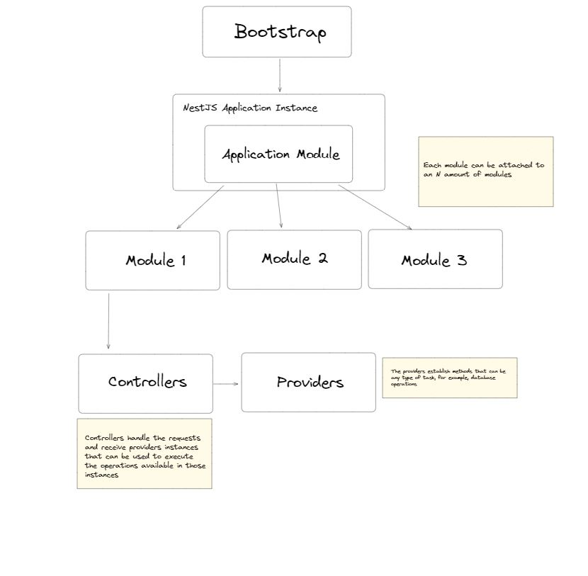

# Nest Products

## Concept

This application is a REST API for CRUD operations where you can create, get, edit and delete users. It was made for learning and practicing NestJS.

I started learning this framework and I really liked it, I made a conceptual map that helps me to understand in a superficial way how we build an application with NestJS at the moment of coding. You can see it down here, I hope it results helpful for you.

## Use guide

To use the application you can enter the url linked to this repository or:

1. git clone https://github.com/Frandols/nest-products
1. cd nest-products
1. npm install
1. npm run start:dev

Enjoy it!
